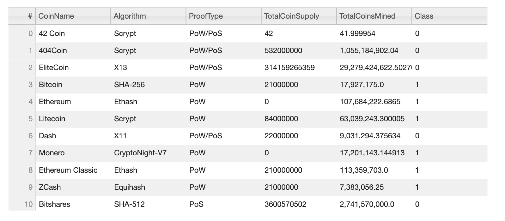
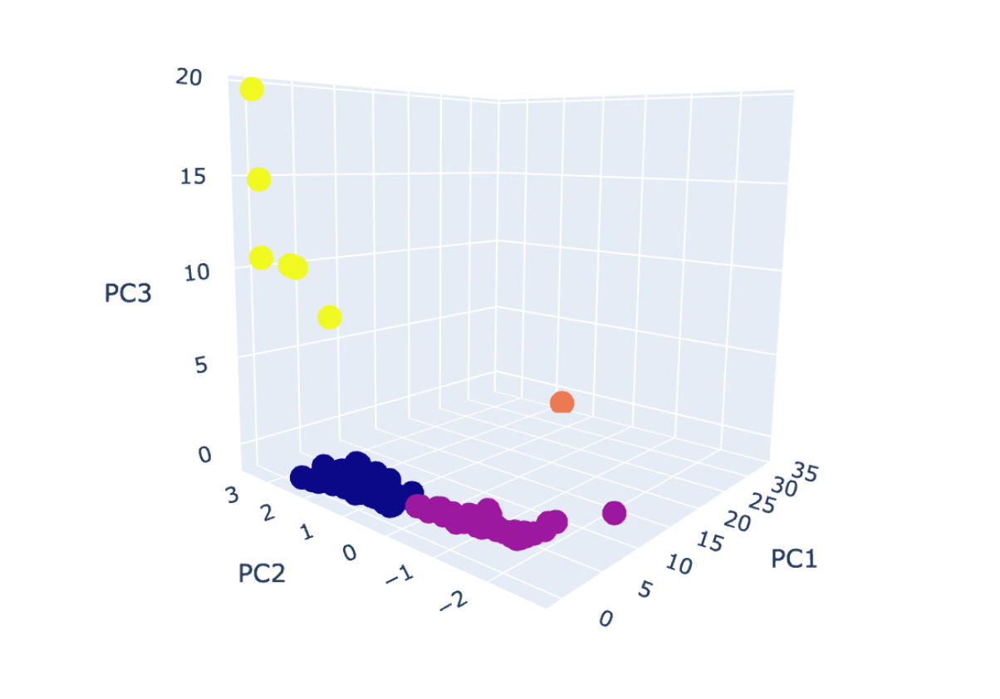
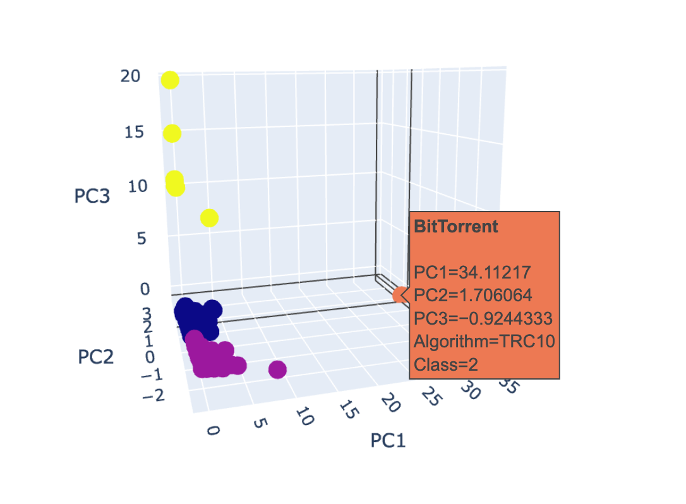
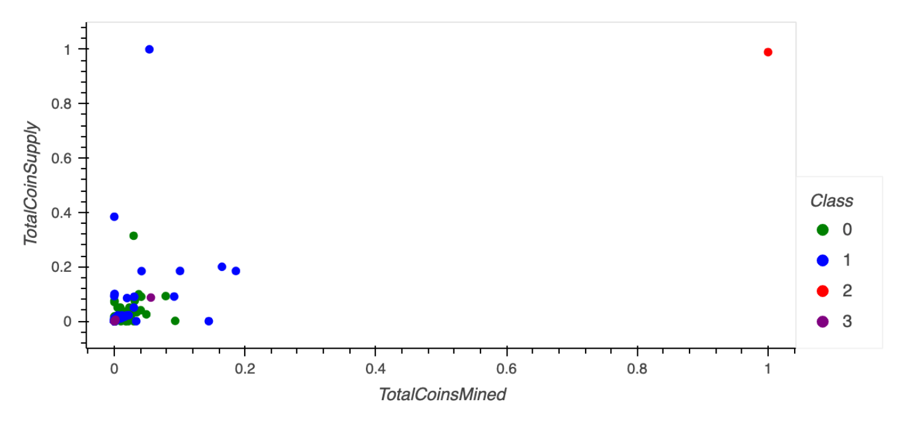

# Cryptocurrencies

## Overview

With so many cryptocurrencies, it is hard to know what to look for when deciding which to invest in. The goal of this project is to explore attributes of tradeable cryptocurrencies using unsupervised learning and to determine if there are any latent features that distinguish them from one another. 

## Results

This table provides relevant data for each cryptocurrency. The final column, Class, is an integer between 0-3 that denotes the class designated by the k-Means algorithm. 

It is evident from the PCA plot that there are 4 distinct groups. The blue and purple markers are separated by PC2, where the former has only positive values for PC2 and the latter having negative values. There is one group, in orange, that is comprised of a single cryptocurrency; this group is distinguished by its large value along the PC1 axis. Lastly, the group in yellow is distinguishable from the other groups in its large values aong the PC3 axis. 

This PCA plot is also interactive. As seen in the image below, placing the curser on a marker reveals a pop-up showing information about the cryptocurrency, including its name and its class.
 

When plotting Total Coins Supply versus Total Coins Mined, 3 of the 4 groups overlap considerably. However, the single data point from group 2 is completely removed from the rest of the points. This is the same cryptocurrency as the one marked in orange in the PCA plot. We can therefore conclude that the Total Coins Supply and Total Coins Mined play a significant role in categorizing cryptocurrencies. However, the large overlap among the other 3 groups contrasts the separation shown in the PCA plot. Therefore, we must also conclude that there are other variables determining the groups besides Total Coin Supply and Total Coins Mined. 

## Summary

The cryptocurrencies can be grouped into 4 distinct groups, where Total Coins Supply and Total Coins Mined play an important, but incomplete, role. Other factors, such as the algorithm and proof type used, also distinguish the cryptocurrencies from each other. With more information about these cryptocurrencies, it may be possible to create well-defined classifications for cryptocurrencies, where each of the four groups shows unique characteristics. 
